# Design patterns

## Creational patterns

### Singleton
Het singleton pattern zorgt ervoor dat er niet meer dan één object van een klasse word aangemaakt.
Deze instance is dan beschikbaar door de volledige code.

*Een toepassing van de singleton is bijvoorbeeld het maken van unieke identificatienummers binnen een programma. Om er altijd zeker van te zijn dat elk identificatienummer uniek is, is het handig om dit door één enkel object te laten genereren. Dit is dan een singleton.* (wikipedia)

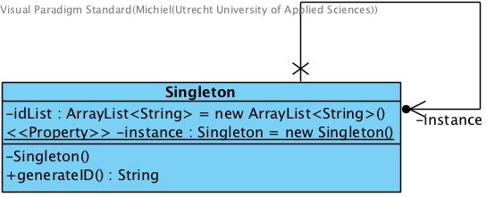

###### *Singleton.java*
```java
public class Singleton {

	private ArrayList<String> idList = new ArrayList<String>();

	private static Singleton instance = new Singleton();

	//Singleton-constructor moet private zijn zodat je niet meerdere instanties aan kan maken
	private Singleton() {};

	public static Singleton getInstance() {
		return instance;
	}

	public String generateID() {
		String uniqueID = UUID.randomUUID().toString();

		if (idList.contains(uniqueID)) {
			System.out.println("id bestaat al.");
			return null;
		} else {
			return uniqueID;
		}

	}

}
```
###### *Main.java*

```java
public class Main {

	public static void main(String[] args) {

		//een instantie van singleton, geen nieuw object.
		Singleton s = Singleton.getInstance();

		System.out.println("ID1: "+s.generateID());
		System.out.println("ID2: "+s.generateID());
		System.out.println("ID3: "+s.generateID());

	}
}
```
### Factory
Het factory pattern is een manier om objecten te instantiëren zonder exact vast te hoeven van welke klasse deze objecten zullen zijn. Er wordt een factory gemaakt die door subklassen geïmplementeerd kan worden. De klasse van het object dat door die methode geïnstantieerd wordt, implementeert een bepaalde interface. Elk van de subklassen kan vervolgens bepalen van welke klasse een object wordt aangemaakt, zolang deze klasse maar die interface implementeert.

*Het doel van dit ontwerppatroon is het vereenvoudigen van het onderhoud van het programma. Als er nieuwe subklassen nodig zijn dan hoeft men alleen een nieuwe factory-methode te implementeren.* (wikipedia)

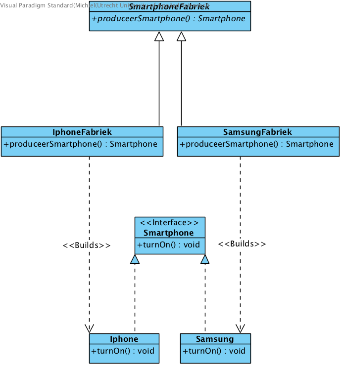

###### *Smartphone.java*

```java
public interface Smartphone {
	public void turnOn();
}

```
###### *Iphone.java*

```java
public class Iphone implements Smartphone{

	@Override
	public void turnOn() {
		System.out.println("De iPhone werkt!");

	}
}
```
###### *Samsung.java*

```java
public class Samsung implements Smartphone {

	@Override
	public void turnOn() {
		System.out.println("De Samsung werkt!");

	}
}
```
###### *SmartphoneFabriek.java*

```java
public abstract class SmartphoneFabriek {

	public abstract Smartphone produceerSmartphone();

}
```
##### *IphoneFabriek.java*

```java
public class IphoneFabriek extends SmartphoneFabriek{

	@Override
	public Smartphone produceerSmartphone() {
		return new Iphone();
	}

}
```
##### *SamsungFabriek.java*

```java
public class SamsungFabriek extends SmartphoneFabriek {

	@Override
	public Smartphone produceerSmartphone() {
		return new Samsung();
	}

}
```
##### *Main.java*

```java
public class Main {

	public static void main(String[] args) {

		SmartphoneFabriek iphoneFabriek = new IphoneFabriek();
		Smartphone iphoneX = iphoneFabriek.produceerSmartphone();
		iphoneX.turnOn();

		SmartphoneFabriek samsungFabriek = new SamsungFabriek();
		Smartphone s9 = samsungFabriek.produceerSmartphone();
		s9.turnOn();

	}

}
```
### Abstract Factory
Het Abstract Factory pattern werkt met een soort super-factory die dan weer andere factories creeërt. Een vaak gebruikt voorbeeld is het maken van specifieke venster voor Mac OS en Windows.
De 'super-factory' is hier de AbstractVensterFactory. Deze creeërt weer de factories die het Windows of Mac venster kunnen gaan produceren.

Je kan dus tijdens runtime kijken welk besturingssysteem er draait en daarop je interface aanpassen.

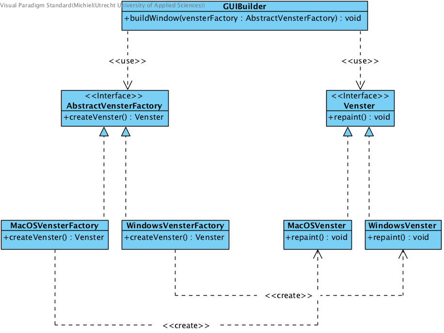

##### *AbstractVensterFactory.java*

```java
public interface AbstractVensterFactory {

	public Venster createVenster();

}
```
##### *MacOSVensterFactory.java*

```java
public class MacOSVensterFactory implements AbstractVensterFactory{

	@Override
	public Venster createVenster() {
		MacOSVenster venster = new MacOSVenster();
		return venster;
	}

}
```
##### *WindowsVensterFactory.java*

```java
public class WindowsVensterFactory implements AbstractVensterFactory{

	@Override
	public Venster createVenster() {
		WindowsVenster venster = new WindowsVenster();

		return venster;
	}

}
```
##### *Venster.java*

```java
public interface Venster {

	public void repaint();

}
```
##### *MacOSVenster.java*

```java
public class MacOSVenster implements Venster{

	@Override
	public void repaint() {
		// Knoppen aanpassen zodat het meer in de Mac OS omgeving past...
		System.out.println("Nieuw MAC OS -venster aangemaakt.");

	}

}
```
##### *WindowsVenster.java*

```java
public class WindowsVenster implements Venster{

	@Override
	public void repaint() {
		// Knoppen aanpassen zodat het meer in de Windows omgeving past...
		System.out.println("Nieuw Windows-venster aangemaakt.");

	}

}
```
##### *GUIBuilder.java*

```java
public class GUIBuilder {

	public void buildWindow(AbstractVensterFactory vensterFactory) {
		Venster venster = vensterFactory.createVenster();
		venster.repaint();
	}
}
```
##### *Main.java*

```java
public class Main {

	public static String platform = "MACOS";

	public static void main(String[] args) {

		GUIBuilder builder = new GUIBuilder();
		AbstractVensterFactory vensterFactory = null;

		if(platform == "MACOS"){
			vensterFactory  = new MacOSVensterFactory();
		} else {
			vensterFactory  = new WindowsVensterFactory();
		}
		builder.buildWindow(vensterFactory);

	}

}
```

### Builder
Het Builder pattern kan een gecompliceerd object bouwen door gebruik te maken van simplere objecten. Het gaat stap voor stap (1. buildDough, 2. buildSauce, 3. buildToppings). Als de builder klaar is dan geeft hij het object (in ons geval een pizza) terug aan de director (in ons geval de waiter).

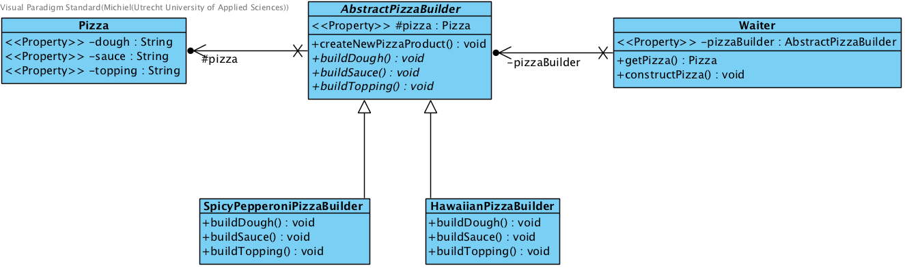

##### *AbstractPizzaBuilder.java*

```java
public abstract class AbstractPizzaBuilder {
	protected Pizza pizza;

    public Pizza getPizza() {
        return pizza;
    }

    public void createNewPizzaProduct() {
        pizza = new Pizza();
    }

    public abstract void buildDough();
    public abstract void buildSauce();
    public abstract void buildTopping();
}
```
##### *SpicyPepperoniPizzaBuilder.java*

```java
public class SpicyPepperoniPizzaBuilder extends AbstractPizzaBuilder{

	@Override
	public void buildDough() {
		pizza.setDough("italiaans");

	}

	@Override
	public void buildSauce() {
		pizza.setSauce("Spicy");

	}

	@Override
	public void buildTopping() {
		pizza.setTopping("Pepperoni, Salami & Pepers");

	}

}

```
##### *HawaiianPizzaBuilder.java*

```java
public class HawaiianPizzaBuilder extends AbstractPizzaBuilder{

	@Override
	public void buildDough() {
		pizza.setDough("karton");

	}

	@Override
	public void buildSauce() {
		pizza.setSauce("zoet");

	}

	@Override
	public void buildTopping() {
		pizza.setTopping("Ham & Ananas");

	}

}
```
##### *Pizza.java*

```java
public class Pizza {
    private String dough;
    private String sauce;
    private String topping;

    public void setDough(String dough) {
        this.dough = dough;
    }

    public void setSauce(String sauce) {
        this.sauce = sauce;
    }

    public void setTopping(String topping) {
        this.topping = topping;
    }

	public String getDough() {
		return dough;
	}

	public String getSauce() {
		return sauce;
	}

	public String getTopping() {
		return topping;
	}
}
```

##### *Waiter.java*

```java
public class Waiter {

	 private AbstractPizzaBuilder pizzaBuilder;

	    public void setPizzaBuilder(AbstractPizzaBuilder pb) {
	        pizzaBuilder = pb;
	    }

	    public Pizza getPizza() {
	        return pizzaBuilder.getPizza();
	    }

	    public void constructPizza() {
	        pizzaBuilder.createNewPizzaProduct();
	        pizzaBuilder.buildDough();
	        pizzaBuilder.buildSauce();
	        pizzaBuilder.buildTopping();
	    }

}
```
##### *Main.java*

```java
public class Main {

	public static void main(String[] args) {

		Waiter waiter = new Waiter();

        AbstractPizzaBuilder hawaiianPizzabuilder = new HawaiianPizzaBuilder();
        AbstractPizzaBuilder spicyPizzaBuilder = new SpicyPepperoniPizzaBuilder();

        waiter.setPizzaBuilder( hawaiianPizzabuilder );
        waiter.constructPizza();

        Pizza pizza = waiter.getPizza();

        System.out.println("Hawaiian Pizza: \nDough: "+pizza.getDough()+" Sauce: "+pizza.getSauce()+" Toppings: "+pizza.getTopping());

        waiter.setPizzaBuilder( spicyPizzaBuilder );
        waiter.constructPizza();

        pizza = waiter.getPizza();

        System.out.println("Spicy Pizza: \nDough: "+pizza.getDough()+" Sauce: "+pizza.getSauce()+" Toppings: "+pizza.getTopping());


	}

}
```
### Prototype
Het Prototype pattern maakt nieuwe objecten door het clonen / kopieeren van een ander object. Dit kost niet veel resources en zorgt dus voor betere performance van je applicatie.

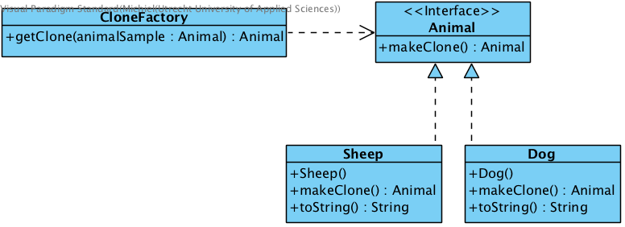

##### *Animal.java*

```java
public interface Animal extends Cloneable {

	public Animal makeClone();

}
```
##### *Sheep.java*

```java
public class Sheep implements Animal {

	public Sheep() {

		System.out.println("Sheep is made.");
	}

	@Override
	public Animal makeClone() {
		System.out.println("Sheep is being cloned.");

		Sheep sheepObject = null;

		try {
			sheepObject = (Sheep) super.clone();
		} catch (CloneNotSupportedException e) {
			e.printStackTrace();
		}

		return sheepObject;
	}

	public String toString() {
		return "Dolly is alive!";
	}

}
```
##### *Animal.java*

```java
public class Dog implements Animal{

	public Dog() {

		System.out.println("Dog is made.");
	}

	@Override
	public Animal makeClone() {
		System.out.println("Dog is being cloned.");

		Dog dogObject = null;

		try {
			dogObject = (Dog) super.clone();
		} catch (CloneNotSupportedException e) {
			e.printStackTrace();
		}

		return dogObject;
	}

	public String toString() {
		return "Baily is alive!";
	}
}
```
##### *CloneFactory.java*

```java
public class CloneFactory {

	public Animal getClone(Animal animalSample) {

		return animalSample.makeClone();

	}

}
```
##### *Main.java*

```java
public class Main {

	public static void main(String[] args) {
		CloneFactory cloneLab = new CloneFactory();

		Sheep Dolly = new Sheep();
		Sheep DollyCloned = (Sheep) cloneLab.getClone(Dolly);

		Dog Baily = new Dog();
		Dog BailyCloned = (Dog) cloneLab.getClone(Baily);

		System.out.println("Orgineel: "+Dolly);
		System.out.println("Clone: "+DollyCloned);

		System.out.println("Orgineel: "+Baily);
		System.out.println("Clone: "+BailyCloned);

	}

}
```
### Object Pool
Het Object Pool pattern maakt een pool van objecten die meerdere clienten kunnen gebruiken. Denk hierbij aan bijvoorbeeld een databaseconnectie. Dit is een 'dure' resource om iedere keer opnieuw aan te maken. Daarom is het logisch om de connectie eenmalig te maken en daarna door meerdere klassen te gebruiken.

Het object pool pattern wordt tegenwoordig niet veel meer gebruikt omdat systemen snel genoeg zijn om ook wat men vroeger 'dure' resources noemden snel uit te kunnen voeren. Het is dan overbodig om pools te vullen. Dit kost dan meer laadtijd en geheugen.

Het wordt soms wel nog gebruikt bij JDBC om snel toegang te krijgen tot een db connectie.

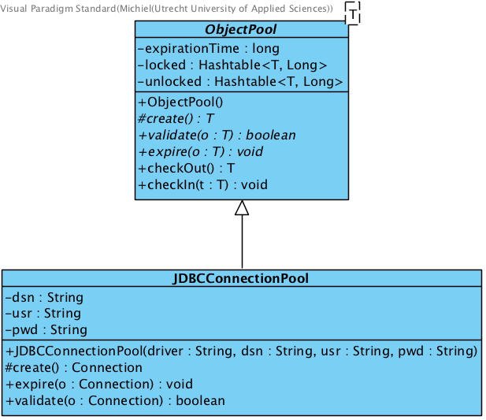

##### *ObjectPool.java*

```java
public abstract class ObjectPool<T> {
	  private long expirationTime;

	  private Hashtable<T, Long> locked, unlocked;

	  public ObjectPool() {
	    expirationTime = 30000; // 30 seconds
	    locked = new Hashtable<T, Long>();
	    unlocked = new Hashtable<T, Long>();
	  }

	  protected abstract T create();

	  public abstract boolean validate(T o);

	  public abstract void expire(T o);

	  public synchronized T checkOut() {
	    long now = System.currentTimeMillis();
	    T t;
	    if (unlocked.size() > 0) {
	      Enumeration<T> e = unlocked.keys();
	      while (e.hasMoreElements()) {
	        t = e.nextElement();
	        if ((now - unlocked.get(t)) > expirationTime) {
	          // object has expired
	          unlocked.remove(t);
	          expire(t);
	          t = null;
	        } else {
	          if (validate(t)) {
	            unlocked.remove(t);
	            locked.put(t, now);
	            return (t);
	          } else {
	            // object failed validation
	            unlocked.remove(t);
	            expire(t);
	            t = null;
	          }
	        }
	      }
	    }
	    // no objects available, create a new one
	    t = create();
	    locked.put(t, now);
	    return (t);
	  }

	  public synchronized void checkIn(T t) {
	    locked.remove(t);
	    unlocked.put(t, System.currentTimeMillis());
	  }
	}
```
##### *JDBCConnectionPool.java*

```java
public class JDBCConnectionPool extends ObjectPool<Connection> {

	  private String dsn, usr, pwd;

	public JDBCConnectionPool(String driver, String dsn, String usr, String pwd) {
	    super();
	    try {
	      Class.forName(driver);
	    } catch (Exception e) {
	      e.printStackTrace();
	    }
	    this.dsn = dsn;
	    this.usr = usr;
	    this.pwd = pwd;
	  }

	  @Override
	  protected Connection create() {
	    try {
	      return (DriverManager.getConnection(dsn, usr, pwd));
	    } catch (SQLException e) {
	      e.printStackTrace();
	      return (null);
	    }
	  }

	  @Override
	  public void expire(Connection o) {
	    try {
	      ((Connection) o).close();
	    } catch (SQLException e) {
	      e.printStackTrace();
	    }
	  }

	  @Override
	  public boolean validate(Connection o) {
	    try {
	      return (!((Connection) o).isClosed());
	    } catch (SQLException e) {
	      e.printStackTrace();
	      return (false);
	    }
	  }
	}
```
##### *Main.java*

```java
public class Main {
	  public static void main(String args[]) {
	    // Create the ConnectionPool:
	    JDBCConnectionPool pool = new JDBCConnectionPool(
	      "org.hsqldb.jdbcDriver", "jdbc:hsqldb://localhost/mydb",
	      "sa", "secret");

	    // Get a connection:
	    Connection con = pool.checkOut();

	    // Use the connection

	    // Return the connection:
	    pool.checkIn(con);

	  }
	}
```
## Behavioral Design Patterns

### Chain of Responsibility
Het Chain of Responsibility pattern is vrij simpel. Het krijgt een request binnen en gaat alle chains (klasses) langs om te kijken of de klassen de request kan afhandelen. Als dit niet het geval is dan word de request doorgegeven naar de volgende klasse.

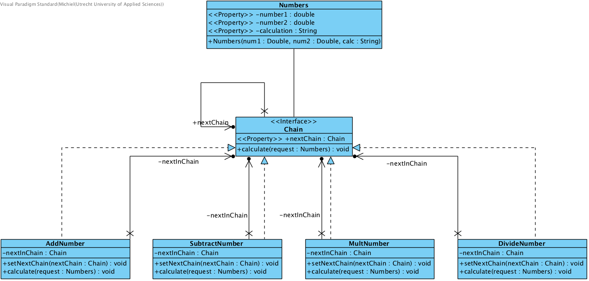

##### *Chain.java*

```java
public interface Chain {
	public void setNextChain(Chain nextChain);
	public void calculate(Numbers request);
}
```
##### *Numbers.java*

```java
public class Numbers {

	private double number1;
	private double number2;

	private String calculation;

	public Numbers(Double num1, Double num2, String calc) {
		number1 = num1;
		number2 = num2;
		calculation = calc;
	}

	public double getNumber1() {
		return number1;
	}

	public double getNumber2() {
		return number2;
	}

	public String getCalculation() {
		return calculation;
	}

}
```
##### *AddNumber.java*

```java
public class AddNumber implements Chain{

	private Chain nextInChain;

	@Override
	public void setNextChain(Chain nextChain) {
		nextInChain = nextChain;

	}

	@Override
	public void calculate(Numbers request) {

		if(request.getCalculation() == "add") {
			Double calculation = (request.getNumber1()+request.getNumber2());
			System.out.println(request.getNumber1() + " + " + request.getNumber2() + " = " + calculation);
		} else {

			nextInChain.calculate(request);
		}

	}

}
```
##### *SubtractNumber.java*

```java
public class SubtractNumber implements Chain{

	private Chain nextInChain;

	@Override
	public void setNextChain(Chain nextChain) {
		nextInChain = nextChain;

	}

	@Override
	public void calculate(Numbers request) {
		if(request.getCalculation() == "sub") {
			Double calculation = (request.getNumber1()-request.getNumber2());
			System.out.println(request.getNumber1() + " - " + request.getNumber2() + " = " + calculation);
		} else {

			nextInChain.calculate(request);
		}

	}

}
```
##### *MultNumber.java*

```java
public class MultNumber implements Chain{

	private Chain nextInChain;

	@Override
	public void setNextChain(Chain nextChain) {
		nextInChain = nextChain;

	}

	@Override
	public void calculate(Numbers request) {
		if(request.getCalculation() == "mult") {
			Double calculation = (request.getNumber1()*request.getNumber2());
			System.out.println(request.getNumber1() + " X " + request.getNumber2() + " = " + calculation);
		} else {

			nextInChain.calculate(request);
		}

	}

}
```

##### *DivideNumber.java*

```java
public class DivideNumber implements Chain{

	private Chain nextInChain;

	@Override
	public void setNextChain(Chain nextChain) {
		nextInChain = nextChain;

	}

	@Override
	public void calculate(Numbers request) {
		if(request.getCalculation() == "div") {
			Double calculation = (request.getNumber1()/request.getNumber2());
			System.out.println(request.getNumber1() + " / " + request.getNumber2() + " = " + calculation);
		} else {

			System.out.println("You can only add, sub, mult & div.");
		}

	}

}
```
##### *Main.java*

```java
public class Main {

	public static void main(String[] args) {

		Chain chainCalc1 = new AddNumber();
		Chain chainCalc2 = new SubtractNumber();
		Chain chainCalc3 = new MultNumber();
		Chain chainCalc4 = new DivideNumber();

		chainCalc1.setNextChain(chainCalc2);
		chainCalc2.setNextChain(chainCalc3);
		chainCalc3.setNextChain(chainCalc4);

		Numbers request = new Numbers(1234.0, 4321.0, "mult");

		chainCalc1.calculate(request);

	}

}
```
### Command
Het command pattern kan code opslaan die later uitgevoerd moet worden. Denk hierbij bijvoorbeeld aan een tv: Als je op de aan-knop drukt moet de tv opgestart worden, er moet dan een lijst aan commando's uitgevoerd worden zodra er op de knop is gedrukt.

Je kan ook undo producdures implementeren voor de commando's die zijn uitgevoerd. Als je bijvoorbeeld nog een keer op de aan-knop drukt zou de tv weer uit moeten gaan.

Een **nadeel** van het command pattern is dat je heel veel kleine klassen aan moet maken die lijstjes met commands bezitten.

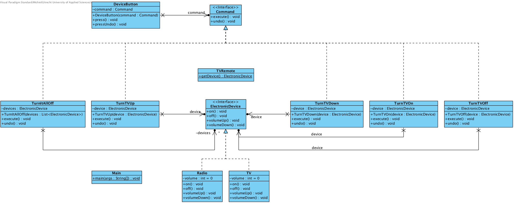

#### Code staat op GitHub in de map Command

### Interpeter

Het Interpeter pattern wordt niet veel gebruikt. Het wordt vooral gebruikt om een representatie van data te converteren naar een andere representatie van dezelfde data.

Omdat dit een pattern is wat nauwelijks gebruikt word zal ik hier geen verdere aandacht aan besteden.

### Iterator

Het iterator pattern itereert zoals de naam al doet vermoeden over collecties. Het mooie van dit pattern is dat de iterator niks van het object hoeft te weten om over de collectie te itereren. Je kan daardoor ook verschillende soorten collecties gebruiken (list, ArrayList etc.).

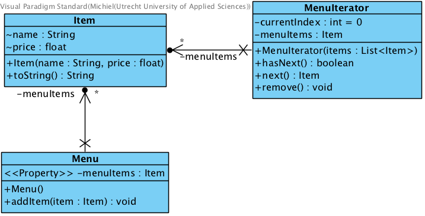

##### *Item.java (object)*

```java
public class Item {

	String name;
	float price;

	public Item(String name, float price) {
		this.name = name;
		this.price = price;
	}

	public String toString() {
		return name + ": $" + price;
	}
}
```
##### *Menu.java (collection)*

```java
public class Menu {

	private List<Item> menuItems;

	public Menu() {
		menuItems = new ArrayList<Item>();
	}

	public void addItem(Item item) {
		menuItems.add(item);
	}

	public List<Item> getMenuItems() {
		return menuItems;
	}

}
```
##### *MenuIterator.java (iterator)*

```java
public class MenuIterator implements Iterator<Item> {

	private List<Item> menuItems;
	private int currentIndex = 0;

	public MenuIterator(List<Item> items) {
		super();
		this.menuItems = items;
	}

	@Override
	public boolean hasNext() {
		if (currentIndex >= menuItems.size()) {
			return false;
		} else {
			return true;
		}
	}

	@Override
	public Item next() {
		return menuItems.get(currentIndex++);
	}

	@Override
	public void remove() {
		menuItems.remove(--currentIndex);
	}

}
```
##### *Main.java*

```java
public class Main {

	public static void main(String[] args) {
		Item i1 = new Item("spaghetti", 7.50f);
		Item i2 = new Item("hamburger", 6.00f);
		Item i3 = new Item("chicken sandwich", 6.50f);

		Menu menu = new Menu();
		menu.addItem(i1);
		menu.addItem(i2);
		menu.addItem(i3);

		System.out.println("Displaying Menu:\n");

		MenuIterator iterator = new MenuIterator(menu.getMenuItems());

		while (iterator.hasNext()) {
			Item item = iterator.next();
			System.out.println(item);
		}

		System.out.println("\nRemoving last item returned");
		iterator.remove();

		System.out.println("\nDisplaying Menu:");
		iterator = new MenuIterator(menu.getMenuItems());
		while (iterator.hasNext()) {
			Item item = iterator.next();
			System.out.println(item);
		}
	}

}
```
### Mediator

Het mediator pattern kan je zien als een derde partij die zorgt voor de comunicatie logica. Bijvoorbeeld een chatbox, de gebruikers hoeven niet rechtstreeks met elkaar in contact te staan maar alles verloopt via een mediator (de chatbox). Een ander voorbeeld is een airtrafic controler; deze zorgt voor de comunicatie tussen de verschillende vluchten. De objecten die met elkaar comuniceren heten colega's. Het mediator pattern zorgt voor lose-coupling tussen deze colega's.

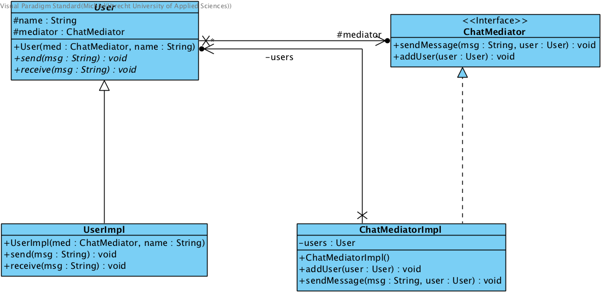

##### *ChatMediator.java*

```java
public interface ChatMediator {

	public void sendMessage(String msg, User user);

	void addUser(User user);
}
```
##### *User.java*

```java
public abstract class User {
	protected ChatMediator mediator;
	protected String name;

	public User(ChatMediator med, String name){
		this.mediator=med;
		this.name=name;
	}

	public abstract void send(String msg);

	public abstract void receive(String msg);
}
```
##### *ChatMediatorImpl.java*

```java
public class ChatMediatorImpl implements ChatMediator {

	private List<User> users;

	public ChatMediatorImpl(){
		this.users = new ArrayList<>();
	}

	@Override
	public void addUser(User user){
		this.users.add(user);
	}

	@Override
	public void sendMessage(String msg, User user) {
		for(User u : this.users){
			//message should not be received by the user sending it
			if(u != user){
				u.receive(msg);
			}
		}
	}

}

```
##### *UserImpl.java*

```java
public class UserImpl extends User {

	public UserImpl(ChatMediator med, String name) {
		super(med, name);
	}

	@Override
	public void send(String msg){
		System.out.println(this.name+": Sending Message: "+msg);
		mediator.sendMessage(msg, this);
	}
	@Override
	public void receive(String msg) {
		System.out.println(this.name+": Received Message: "+msg);
	}

}
```
##### *Main.java*

```java
public class Main {
	public static void main(String[] args) {
		ChatMediator mediator = new ChatMediatorImpl();
		User user1 = new UserImpl(mediator, "Michiel");
		User user2 = new UserImpl(mediator, "John");
		User user3 = new UserImpl(mediator, "Paul");
		User user4 = new UserImpl(mediator, "Sarah");
		mediator.addUser(user1);
		mediator.addUser(user2);
		mediator.addUser(user3);
		mediator.addUser(user4);

		user1.send("Hi there!");

	}
}
```
### Observer

Het Observer pattern stuurt bij een verandering van het object dat geobserveerd wordt een notificatie naar de objecten die observeren. In het voorbeeld heb ik gebruik gemaakt van een weerstation. Als er een weerupdate binnen komt dan stuurt de Weather implementatie een update naar alle observers (website & screen) met de tempratuur & luchtvochtigheid.

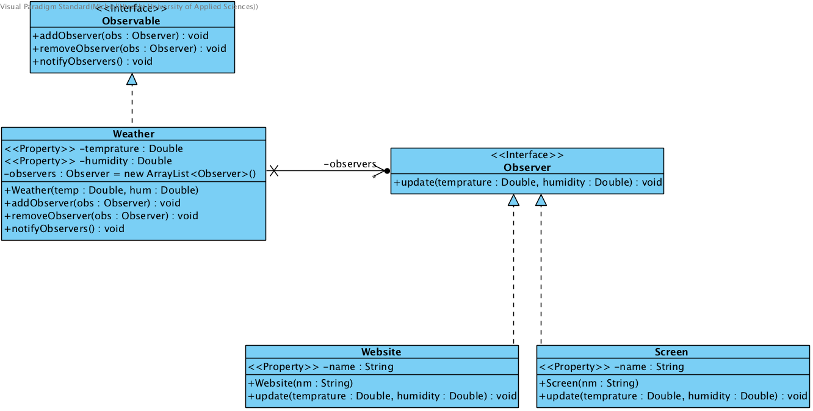

##### *Observable.java*

```java
public interface Observable {

	public void addObserver(Observer obs);
	public void removeObserver(Observer obs);
	public void notifyObservers();

}
```
##### *Weather.java*

```java
public class Weather implements Observable{

	private List<Observer> observers = new ArrayList<Observer>();
	private Double temprature;
	private Double humidity;

	public Weather(Double temp, Double hum) {
		this.temprature = temp;
		this.humidity = hum;
	}

	@Override
	public void addObserver(Observer obs) {
		observers.add(obs);
		System.out.println("Observer "+obs+" added.");

	}

	@Override
	public void removeObserver(Observer obs) {
		observers.remove(obs);
		System.out.println("Observer "+obs+" removed.");


	}

	public Double getTemprature() {
		return temprature;
	}

	public void setTemprature(Double temprature) {
		this.temprature = temprature;
		notifyObservers();
	}

	public Double getHumidity() {
		return humidity;
	}

	public void setHumidity(Double humidity) {
		this.humidity = humidity;
		notifyObservers();
	}

	@Override
	public void notifyObservers() {
		for (Observer ob : observers) {
			ob.update(this.temprature, this.humidity);

		}

	}

}
```
##### *Observer.java*

```java
public interface Observer {
	public void update(Double temprature, Double humidity);

}
```
##### *Website.java*

```java
public class Website implements Observer{
	private String name;

	public Website(String nm) {
		name = nm;
	}
	public String getName() {
		return name;
	}
	public void setName(String name) {
		this.name = name;
	}
	@Override
	public void update(Double temprature, Double humidity) {
		System.out.println(name+": The temprature is: "+temprature+" the humidity is: "+humidity);

	}

}
```
##### *Screen.java*

```java
public class Screen implements Observer{
	private String name;

	public Screen(String nm) {
		name = nm;
	}

	public String getName() {
		return name;
	}

	public void setName(String name) {
		this.name = name;
	}

	@Override
	public void update(Double temprature, Double humidity) {
		System.out.println(name+": The temprature is: "+temprature+" the humidity is: "+humidity);

	}

}
```
##### *Main.java*

```java
public class Main {

	public static void main(String[] args) {
		Weather weather = new Weather(28.7, 50.0);
		Observer screen = new Screen("Screen");
		Observer website = new Website("Website");

		weather.addObserver(screen);
		weather.addObserver(website);

		weather.setTemprature(30.0);

		weather.removeObserver(screen);

		weather.setHumidity(80.0);


	}
}
```
### Strategy

Het strategy pattern zorgt ervoor dat je algortimes kan implementeren op een simple en overzichtelijke manier. In het voorbeeld kan je bij vervoersmiddel aangeven of het voertuig wel of niet kan rijden door bij *setRijMogelijkheid* een kanRijden of kanNietRijden object aan te maken. Dit kan je tijdens runtime eventueel weer veranderen.

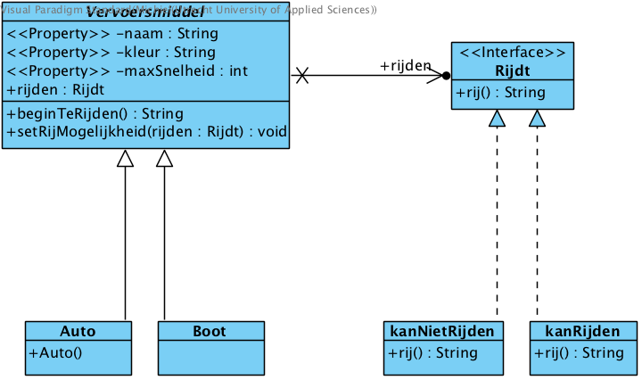

#### Code staat op GitHub in de map Strategy

### Template method


*"Defines the skeleton of an algorithm in a method, deferring some steps to subclasses. Template Method lets subclasses redefine certain steps of an algorithm without changing the algorithms structure."* - GOF

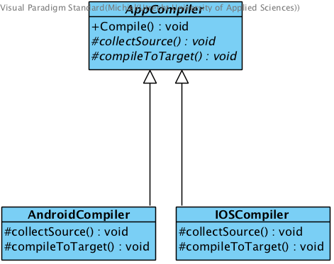

##### *AppCompiler.java*

```java
public abstract class AppCompiler {

	//Deze final kan niet overschreven worden en zal dus altijd in deze volgorde plaatsvinden
	public final void Compile() {
		collectSource();
		compileToTarget();
	}

	//Template methods (kunnen binnen de implementatie aangepast worden)
	protected abstract void collectSource();
	protected abstract void compileToTarget();
}
```
##### *AndroidCompiler.java*

```java
public class AndroidCompiler extends AppCompiler {

	@Override
	protected void collectSource() {
		System.out.println("Source collected");

	}

	@Override
	protected void compileToTarget() {
		System.out.println("Target Compiled");

	}

}
```
##### *IOSCompiler.java*

```java
public class IOSCompiler extends AppCompiler {

	@Override
	protected void collectSource() {
		System.out.println("Source collected");

	}

	@Override
	protected void compileToTarget() {
		System.out.println("Target Compiled");

	}

}
```
##### *Main.java*

```java
public class Main {

	public static void main(String[] args) {

		AppCompiler iPhoneApp = new IOSCompiler();
		AppCompiler AndroidApp = new AndroidCompiler();

		iPhoneApp.Compile();
		AndroidApp.Compile();


	}

}
```
